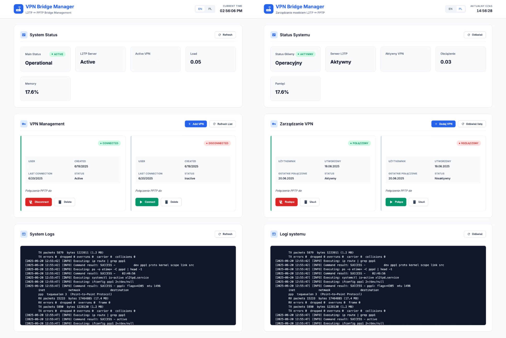

# 🌐 VPNBridge: Seamless L2TP ↔ PPTP VPN Management

🚀 **Hooray! No more PPTP headaches for macOS users!** I created **VPNBridge** to tackle the frustrating lack of PPTP protocol support in the latest macOS versions, and I'm thrilled to say it solves this problem with a smile! 🎉 This PHP-based web application bridges L2TP to PPTP VPNs, letting you securely connect to PPTP networks from macOS or any device, with a user-friendly interface to manage everything effortlessly. Say goodbye to compatibility woes and hello to seamless VPN bridging!

**VPNBridge** is a powerful, open-source tool designed to simplify the management of L2TP to PPTP VPN bridges on Linux systems. With a modern web interface, RESTful API, and robust debugging tools, it’s perfect for network administrators and enthusiasts looking to configure, monitor, and control VPN connections with ease. Whether you’re bridging networks for macOS compatibility or managing enterprise VPNs, VPNBridge has you covered! 😎



---

## ✨ **Key Features**

- **🔐 VPN Management**: Add, update, delete, and connect to PPTP VPNs with a few clicks or API calls.
- **🌐 Automatic Network Detection**: Detects L2TP network configurations and sets up routing like magic.
- **📊 Real-Time Monitoring**: Keep an eye on L2TP server status, active VPNs, system load, and memory usage.
- **🛠️ Comprehensive Debugging**: Dive deep into routing and connectivity diagnostics to squash bugs fast.
- **📜 Robust Logging**: Track every action and error with detailed logs for peace of mind.
- **🖥️ Stunning Web Interface**: A responsive, multi-language (English/Polish) HTML-based interface that’s a joy to use.
- **🤖 RESTful API**: Programmatically control VPN operations with a powerful PHP-based API.
- **🔄 PPTP Bridging**: Seamlessly routes L2TP clients to PPTP servers, solving macOS PPTP compatibility issues.

## 🎯 **Use Cases**

- 🌉 Bridging L2TP and PPTP networks for secure, cross-protocol communication, especially for macOS users.
- 🖧 Managing VPN connections on Linux-based servers with minimal hassle.
- 🔍 Monitoring and debugging VPN performance and routing issues in real-time.
- 🛠️ Simplifying network administration for small to medium-sized networks or home labs.

---

## 🛠️ **Prerequisites**

Before diving into VPNBridge, ensure your system is ready to roll:

| Requirement | Details |
|-------------|---------|
| **Operating System** | Linux (Ubuntu/Debian recommended) |
| **PHP** | Version 7.4+ with `json` extension enabled |
| **Web Server** | Apache2 or Nginx configured for PHP |
| **VPN Software** | `xl2tpd` (L2TP), `pptp-linux` (PPTP), `iptables` (routing/NAT) |
| **Permissions** | Root or sudo access for system commands |
| **Dependencies** | `ip`, `ifconfig`, `ping`, `ps` utilities (usually pre-installed) |

---

## 📦 **Installation**

> ℹ️ **Note**: A one-click `install.sh` script for multiple Linux distributions is in the works! For now, use the manual steps or the preliminary script included in the repository.

### 🖱️ **Manual Installation**

1. **Clone the Repository**  
   Grab the latest code and hop into the project:  
   ```bash
   git clone https://github.com/Mavix123/VPNBridge.git
   cd VPNBridge
   ```

2. **Set Up Project Files**  
   Copy the core files (`index.html`, `api.php`, `debug.php`) to your web server’s document root:  
   ```bash
   sudo cp index.html api.php debug.php /var/www/html/
   ```

3. **Install Dependencies**  
   Get the required packages for your Linux system:  
   ```bash
   sudo apt update
   sudo apt install php php-json xl2tpd pptp-linux iptables apache2 strongswan iptables-persistent
   ```

4. **Configure Directories & Permissions**  
   Create directories for VPN configs and logs, and set secure permissions:  
   ```bash
   sudo mkdir -p /etc/vpn-bridge /var/log/vpn-bridge /etc/ppp/peers
   sudo chmod 755 /etc/vpn-bridge /var/log/vpn-bridge /etc/ppp/peers
   sudo touch /var/log/vpn-bridge/bridge.log /etc/vpn-bridge/vpn_list.json
   sudo chmod 644 /var/log/vpn-bridge/bridge.log /etc/vpn-bridge/vpn_list.json
   ```

5. **Configure Web Server**  
   Ensure Apache supports PHP and restart it:  
   ```bash
   sudo a2enmod php
   sudo systemctl restart apache2
   ```

6. **Set Up L2TP Server**  
   Configure `/etc/xl2tpd/xl2tpd.conf` for L2TP. Example:  
   ```ini
   [lns default]
   ip range = 10.0.20.2-10.0.20.254
   local ip = 10.0.20.1
   require chap = yes
   refuse pap = yes
   require authentication = yes
   pppoptfile = /etc/ppp/options.l2tpd
   ```
   Create `/etc/ppp/options.l2tpd`:  
   ```bash
   sudo bash -c 'echo -e "require-mschap-v2\nms-dns 8.8.8.8\nms-dns 8.8.4.4\nasyncmap 0\nnoauth\ncrtscts\nlock\nmaxfail 0\nlcp-echo-failure 4\nlcp-echo-interval 30" > /etc/ppp/options.l2tpd'
   ```
   Restart the L2TP service:  
   ```bash
   sudo systemctl restart xl2tpd
   ```

7. **Configure PPTP Options**  
   Set up `/etc/ppp/options.pptp` for PPTP connections:  
   ```bash
   sudo bash -c 'echo -e "lock\nnoauth\nnobsdcomp\nnodeflate\nrequire-mppe-128" > /etc/ppp/options.pptp'
   sudo chmod 644 /etc/ppp/options.pptp
   ```

8. **Set Up IPSec (StrongSwan)**  
   Configure `/etc/ipsec.conf`:  
   ```ini
   config setup
       charondebug="all"
       uniqueids=yes
   conn L2TP-PSK
       authby=secret
       pfs=no
       rekey=no
       keyingtries=3
       dpddelay=30
       dpdtimeout=120
       dpdaction=clear
       left=%any
       leftprotoport=17/1701
       right=%any
       rightprotoport=17/%any
       type=transport
       auto=add
   ```
   Set up `/etc/ipsec.secrets`:  
   ```bash
   sudo bash -c 'echo ": PSK \"$(openssl rand -base64 32)\"" > /etc/ipsec.secrets'
   sudo chmod 600 /etc/ipsec.secrets
   ```
   Restart StrongSwan:  
   ```bash
   sudo systemctl restart strongswan-starter
   ```

9. **Test the Setup**  
   Fire up your browser and visit `http://<your-server-ip>/index.html` to check the web interface. Test the API with:  
   ```bash
   curl http://<your-server-ip>/api.php?action=status
   ```

### 🚀 **Using the Installation Script**  
For a quicker setup, use the included `install.sh` script:  
```bash
chmod +x install.sh
sudo ./install.sh
```
The script automates the above steps, prompts for L2TP credentials, and configures everything for you. It’s tailored for Debian-based systems but will soon support more distributions! 🌟

---

## 📖 **Usage**

### 🌐 **Web Interface**  
Head to `http://<your-server-ip>/index.html` to:  
- 📊 Monitor system status (L2TP server, active VPN, CPU load, memory).  
- 🔐 Manage PPTP VPNs (add, connect, disconnect, delete).  
- 📜 View real-time system logs.  
- 🌍 Switch between English and Polish with a single click.  

The interface is responsive, intuitive, and packed with real-time notifications to keep you in the loop! 😄

### 🤖 **API Endpoints**  
The `api.php` at `http://<your-server-ip>/api.php` offers a RESTful API for programmatic control. Below are the key endpoints with examples:

| Action | Method | Endpoint | Description |
|--------|--------|----------|-------------|
| **Get VPN List** | GET | `/api.php?action=vpns` | Lists all PPTP VPNs |
| **Add VPN** | POST | `/api.php?action=vpns` | Creates a new PPTP VPN |
| **Update VPN** | PUT | `/api.php?action=vpn&id=<vpn_id>` | Updates a VPN config |
| **Delete VPN** | DELETE | `/api.php?action=vpn&id=<vpn_id>` | Deletes a VPN |
| **Connect VPN** | POST | `/api.php?action=connect&id=<vpn_id>` | Connects to a VPN |
| **Disconnect VPN** | POST | `/api.php?action=disconnect` | Disconnects the active VPN |
| **Get Logs** | GET | `/api.php?action=logs&lines=<number>` | Fetches recent logs |
| **Get Status** | GET | `/api.php?action=status` | Shows system & VPN status |
| **Debug Routing** | GET | `/api.php?action=debug` | Detailed routing diagnostics |
| **Test Routing** | GET | `/api.php?action=test` | Tests L2TP-to-PPTP routing |
| **Reset Routing** | POST | `/api.php?action=reset` | Resets routing config |

#### **Example: Add a VPN**  
Request:  
```json
{
  "name": "Warsaw Office",
  "server": "pptp.example.com",
  "username": "user1",
  "password": "secure123",
  "description": "Office PPTP VPN"
}
```
Command:  
```bash
curl -X POST -H "Content-Type: application/json" -d '{"name":"Warsaw Office","server":"pptp.example.com","username":"user1","password":"secure123","description":"Office PPTP VPN"}' http://<your-server-ip>/api.php?action=vpns
```
Response:  
```json
{
  "success": true,
  "vpn_id": "warsaw_office"
}
```

#### **Example: Check Status**  
Command:  
```bash
curl http://<your-server-ip>/api.php?action=status
```
Response:  
```json
{
  "success": true,
  "data": {
    "main_l2tp": true,
    "active_vpn": "warsaw_office",
    "ppp_interface": true,
    "bridge_routing": true,
    "system_load": 0.25,
    "memory_usage": 45.2,
    "uptime": "2d 3h 45m",
    "l2tp_network": "10.0.20.0/24"
  }
}
```

#### **Example: Debug Routing**  
Command:  
```bash
curl http://<your-server-ip>/api.php?action=debug
```
Response (abridged):  
```json
{
  "success": true,
  "data": {
    "timestamp": "2025-06-20 14:20:00",
    "summary": {
      "l2tp_active": "YES",
      "pptp_active": "YES",
      "ip_forwarding": "1"
    },
    "pptp_gateway": "192.168.1.1"
  }
}
```

### 🔍 **Connecting a Client**  
To connect a macOS (or other) client to a PPTP server via VPNBridge:  
- **Server**: `<your-server-ip>`  
- **Protocol**: L2TP/IPSec with PSK  
- **Username/Password**: From `/etc/vpn-bridge/credentials.txt`  
- **Shared Secret**: From `/etc/vpn-bridge/credentials.txt`  
Use the web interface or API to bridge the L2TP client to a PPTP VPN server.

### 🛠️ **Debugging**  
- Check logs: `cat /var/log/vpn-bridge/bridge.log` or use `/api.php?action=logs`  
- Run diagnostics: `curl http://<your-server-ip>/api.php?action=debug`  
- Test routing: `curl http://<your-server-ip>/api.php?action=test`  
- Run `debug.php` standalone: `php /var/www/html/debug.php`

---

## 🛠️ **Troubleshooting**

- **VPN Won’t Connect?**  
  - Check `/var/log/vpn-bridge/bridge.log` or `/var/log/syslog`.  
  - Ensure `xl2tpd` and `strongswan-starter` are running: `sudo systemctl status xl2tpd strongswan-starter`.  
- **Routing Issues?**  
  - Use the `debug` or `test` endpoints to inspect routing tables and iptables.  
  - Reset routing: `curl -X POST http://<your-server-ip>/api.php?action=reset`.  
- **Permission Errors?**  
  - Verify `www-data` has access: `ls -l /etc/vpn-bridge /var/log/vpn-bridge /etc/ppp/peers`.  
- **Web Interface Not Loading?**  
  - Confirm Apache is running: `sudo systemctl status apache2`.  
  - Check PHP module: `sudo a2enmod php` and restart Apache.

---

## 🤝 **Contributing**

We’re pumped to have you on board! 🚀 To contribute:  
1. Fork the repo: `https://github.com/Mavix123/VPNBridge`.  
2. Create a feature branch: `git checkout -b feature/cool-new-thing`.  
3. Commit your changes: `git commit -m "Added cool new thing"`.  
4. Push it: `git push origin feature/cool-new-thing`.  
5. Open a pull request and tell us about your awesome work!  

Please include tests and update docs. A `CONTRIBUTING.md` is coming soon! 📝

---

## 🚀 **Roadmap**

- 🌟 One-click `install.sh` for all major Linux distros.  
- 📈 Network traffic graphs in the web interface.  
- 🔒 Support for OpenVPN and WireGuard protocols.  
- 🛡️ Encrypted storage for VPN credentials.  
- 📱 Mobile app for remote VPN management.

---

## 📜 **License**

VPNBridge is proudly licensed under the [MIT License](LICENSE). Use it, tweak it, share it! 💖

---

## 🌟 **Get Involved**

- ⭐ Star the repo to spread the love!  
- 🐛 Report bugs or suggest features at [GitHub Issues](https://github.com/Mavix123/VPNBridge/issues).  
- 💬 Chat about VPNBridge on [X](https://x.com) with `#VPNBridge`.  

---

**Happy Bridging!**  
Created with ❤️ by Marcin Kowalkowski  
**Generated on**: June 20, 2025  
**Version**: 1.0
